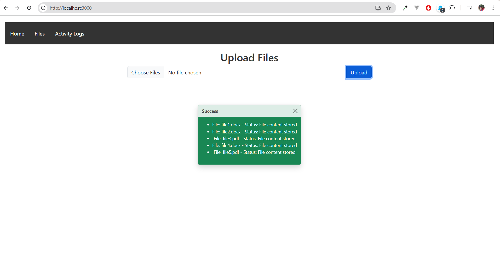
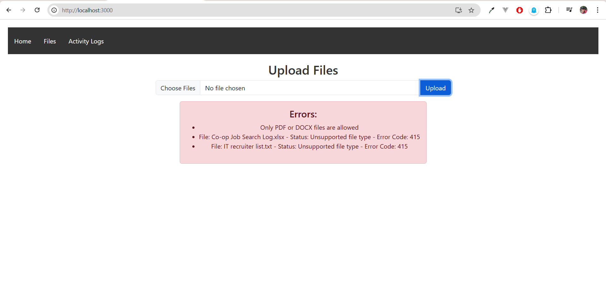
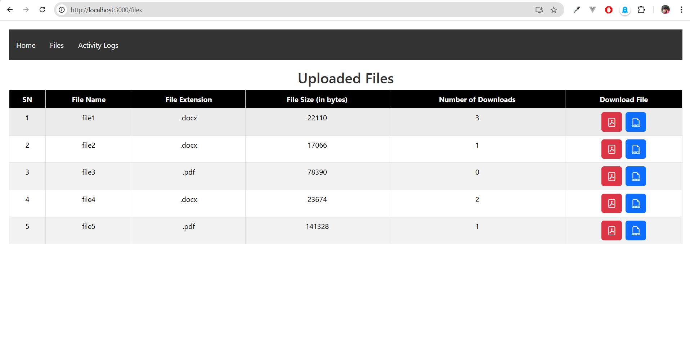
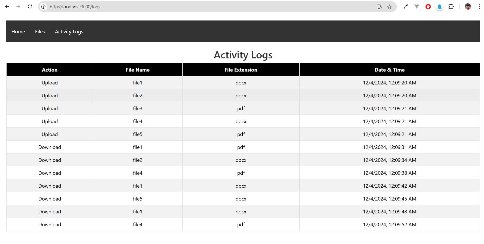

# Files Storage Python

## Overview

This project allows user to upload files (pdf or docx), extracts and the content of those files in MongoDB database and download the stored content as a pdf or docx file. It includes a backend API built using FastAPI and a frontend application built with React.

## Prerequisites

Before setting up the project, please ensure the following already installed on system:

1. **Python 3.x**

   - Download and install Python from the official [Python website](https://www.python.org/downloads/).

2. **pip**

   - `pip` is the package installer for Python. It usually comes pre-installed with Python. Verify the installation with:
     ```sh
     pip --version
     ```
   - If not installed, follow the instructions on the [pip installation page](https://pip.pypa.io/en/stable/installation/).

3. **Node.js and npm**

   - Node.js is a JavaScript runtime, and npm is the Node.js package manager. Download and install both from the official [Node.js website](https://nodejs.org/).
   - Verify the installations with:
     ```sh
     node --version
     npm --version
     ```

4. **MongoDB Compass**
   - MongoDB Compass is a GUI for MongoDB that makes it easier to manage your databases. Download it from the [MongoDB Compass website](https://www.mongodb.com/try/download/compass).
   - Alternatively, use the MongoDB CLI if preferable.

### Additional Notes

Make sure to restart terminal or command prompt after installing these tools to ensure they are properly recognized by the working system.

## Directory Structure

### **backend**

#### controllers

- `file_controller.py`:

  - _Description_: Manages file-related API endpoints.

  - _Imports_:

    - `APIRouter`, `UploadFile`, `File`, `HTTPException` from `FastAPI`.
    - `List` from `typing`.

  - _Services_:

    - `upload_file_service`, `get_files_service`, `download_file_service`, `get_activity_log_service` from `services.file_service`.

  - _Router Definition_:

    - `router = APIRouter()`: Initializes the API router for the file-related routes.

  - _Endpoints_:

    - **Upload File**

      - Endpoint: `/upload`
      - Method: `POST`
      - Description: Uploads single or multiple files.
      - Parameters: files (List[UploadFile]) - The files to be uploaded.
      - Response: Calls `upload_file_service(files)` and returns the result.
      - Error Handling: Catches exceptions and raises HTTPException with status code 400.

    - **Get Files**

      - Endpoint: `/files`
      - Method: `GET`
      - Description: Retrieves a list of uploaded files.
      - Parameters: None
      - Response: Calls `get_files_service()` and returns list of files with details the result.
      - Error Handling: Catches exceptions and raises HTTPException with status code 400.

    - **Download File**

      - Endpoint: `/download/{file_id}/{file_type}`
      - Method: `GET`
      - Description: Downloads a specific file in the specified format.
      - Parameters:
        - `file_id` (str) - The ID of the file to be downloaded.
        - `file_type` (str) - The format of the file to be downloaded (pdf or docx).
        - Response: Calls download_file_service(file_id, file_type) and returns the result.
        - Error Handling: Catches exceptions and raises HTTPException with status code 400.

    - **Get Activity Logs**

      - Endpoint: `/activity_logs`
      - Method: `GET`
      - Description: Retrieves the activity logs of file uploads and downloads.
      - Parameters: None
      - Response: Calls get_activity_log_service() and returns the result.
      - Error Handling: Catches exceptions and raises HTTPException with status code 400.

#### fonts

- `DejaVuSans.ttf`:

  - _Description_: This font supports a wide range of Unicode characters, making it suitable for multi-language text rendering, including special characters, symbols, and various scripts.

#### models

- `file_model.py`:

  - _Description_: Connects to the DB in MongoDB Compass, if not found creates new DB and collections.

  - _Imports_:

    - import `MongoClient` from `pymongo`.
    - import `datetime` from `datetime`.

  - _MongoDB Client Initialization_:

    - `client = MongoClient('mongodb://localhost:27017/')`: Connects to the MongoDB server running locally.
    - `db = client['fileDB']`: Accesses the fileDB database.
    - `file_collection = db['files']`: Accesses the files collection in the fileDB database.
    - `log_collection = db['logs']`: Accesses the logs collection in the fileDB database.

  - _File Schema Definition_:

    - `def file_schema(filename, file_extension, file_size, content)`: Defines the structure for a file document.
    - Attributes:
      - `filename`: Name of the file.
      - `file_extension`: Extension of the file (e.g., .pdf, .docx).
      - `file_size`: Size of the file.
      - `content`: Content of the file.
      - `download_count`: Counter for how many times the file has been downloaded, initialized to 0.

  - _Log Schema Definition_:

    - `def log_schema(action, details)`: Defines the structure for a log document.
    - Attributes:
      - `action`: Type of action performed (e.g., upload, download).
      - `details`: Details about the action (filename and file extension).
      - `timestamp`: Timestamp of when the action occurred, set to the current date and time.

#### services

- `file_service.py`:

  - _Description_: Handles the core functionality related to file management, including uploading, retrieving, and downloading files, as well as logging activities.

  - _Imports_:

    - `ObjectId` from `bson` for handling MongoDB ObjectIds.
    - `HTTPException`, `UploadFile` from `fastapi` for handling HTTP exceptions and file uploads.
    - `StreamingResponse` from `fastapi.responses` for streaming file responses.
    - Models and utilities:
      - `file_collection`, `log_collection`, `file_schema`, `log_schema` from `models.file_model`.
      - `convert_objectid` from `utils.json_utils`.
      - `read_docx`, `read_pdf`, `generate_pdf`, `generate_docx` from `utils.file_utils`.

  - _Log Activity Function_:

    - `async def log_activity(action, details)`: Logs an activity in the database.
    - Parameters:
      - `action`: Type of action (e.g., upload, download).
      - `details`: Additional details about the action.
    - Operation:
      - Inserts a log document into the `log_collection` using the `log_schema`.

  - _Upload File Service_:

    - `async def upload_file_service(files: list[UploadFile])`: Handles file uploads.
    - Parameters:
    - `files`: List of files to be uploaded.
    - Operations:
      - Checks for empty filenames and valid file extensions.
      - Reads file content based on file type (pdf or docx).
      - Stores file content in the database using `file_schema`.
      - Logs the upload activity.
    - Response: Returns a list of responses indicating the status of each file upload.

  - _Get Files Service_:

    - `async def get_files_service()`: Retrieves a list of uploaded files.
    - Operations:
      - Fetches files from `file_collection` excluding the `content` field.
      - Converts ObjectIds to strings for JSON serialization.
    - Response:
      - Returns a list of files without their content.

  - _Download File Service_:

    - `async def download_file_service(file_id, file_type)`: Handles file downloads.
    - Parameters:
      - `file_id`: ID of the file to be downloaded.
      - `file_type`: Desired file type for the download (pdf or docx).
    - Operations:
      - Retrieves the file record from the database.
      - Generates the file in the requested format using utility functions.
      - Updates the download count in the database.
      - Logs the download activity.
    - Response:
      - Returns a `StreamingResponse` with the file content and appropriate headers.

  - _Get Activity Log Service_:

    - `async def get_activity_log_service()`: Retrieves activity logs.
    - Operations:
      - Fetches logs from `log_collection`.
      - Converts ObjectIds to strings for JSON serialization.
    - Response:
      - Returns a list of activity logs.

#### utils

- `file_utils.py`:

  - _Description_: Provides utility functions for reading content from PDF and DOCX files and generating these file types and ensures proper handling of file uploads, conversions, and error management during these processes.

  - _Imports_:

    - `io` for handling in-memory file operations.
    - `docx` for reading and writing DOCX files.
    - `PdfReader` from `pypdf` for reading PDF files.
    - `FPDF` from `fpdf` for generating PDF files.
    - `HTTPException`, `UploadFile` from `fastapi` for handling HTTP exceptions and file uploads.

  - _Functions_:

    - **Read PDF**

      - `async def read_pdf(file: UploadFile)`: Reads content from a PDF file.
      - Parameters:
        - `file`: The PDF file to be read (as `UploadFile`).
      - Operations:
        - Reads the file content into a buffer.
        - Uses `PdfReader` to extract text from each page.
        - Checks for encryption and empty content, raising exceptions if necessary.
      - Returns:
        - Extracted text from the PDF.

    - **Read DOCX**

      - `async def read_docx(file: UploadFile)`: Reads content from a DOCX file.
      - Parameters:
        - `file`: The DOCX file to be read (as `UploadFile`).
          -Operations:
        - Reads the file content into a buffer.
        - Uses `docx.Document` to extract text from each paragraph.
        - Checks for empty content and handles corrupted/encrypted files with exceptions.
      - Returns:
        - Extracted text from the DOCX.

    - **Generate PDF**

      - `async def generate_pdf(content)`: Generates a PDF file from the provided text content.
      - Parameters:
        - `content`: The text content to be included in the PDF.
      - Operations:
        - Initializes an `FPDF` object.
        - Sets up font, margins, and page settings.
        - Writes the content to the PDF with proper formatting.
      - Returns:
        - In-memory buffer containing the generated PDF file.

    - **Generate DOCX**
      - `async def generate_docx(content)`: Generates a DOCX file from the provided text content.
      - Parameters:
        - `content`: The text content to be included in the DOCX.
      - Operations:
        - Initializes a `docx.Document` object.
        - Writes the content to the DOCX with proper formatting.
      - Returns:
        - In-memory buffer containing the generated DOCX file.

- `json_utils.py`:

  - _Description_: Contains a utility function to convert MongoDB ObjectId instances into strings, facilitating JSON serialization and making it easier to work with MongoDB documents in a web application.

  - _Imports_:

    - `ObjectId` from `bson` to identify and work with MongoDB ObjectId instances.

  - _Function_:

    - **Convert ObjectId**
      - `def convert_objectid(document)`: Recursively converts MongoDB ObjectId instances within a document into strings.
      - Parameters:
        - `document`: The document (or list of documents) to be processed. This can be a list, a dictionary, or a single value.
      - Operations:
        - Check List: If the document is a list, recursively applies convert_objectid to each item in the list.
        - Check Dictionary: If the document is a dictionary, recursively applies convert_objectid to each key-value pair.
        - Check ObjectId: If the document is an ObjectId, converts it to a string.
        - Return Value: Returns the processed document with ObjectId instances converted to strings.

### `main.py`

- _Description_: This is the entry point for the application. It sets up the application, configures middleware (such as CORS), and includes the router for file-related operations. This setup enables the application to handle HTTP requests and manage file uploads, downloads, and other related actions.

- _Imports_:

  - `FastAPI` from `fastapi`: To create the FastAPI application.
  - `CORSMiddleware` from ``fastapi.middleware.cors`: To handle Cross-Origin Resource Sharing (CORS).
  - `file_router` from `controllers.file_controller`: Imports the router for file-related endpoints.

- _Create FastAPI Application_:

  - `app = FastAPI()`: Initializes a new FastAPI application instance.

- _Enable CORS_:

  - `app.add_middleware(CORSMiddleware, ...)`: Adds CORS middleware to the FastAPI application to allow cross-origin requests.

  - Parameters:

    - `allow_origins`: Specifies which origins are allowed to make requests to the API (`*` allows all origins).
    - `allow_credentials`: Indicates whether or not the browser should send cookies along with the requests.
    - `allow_methods`: Specifies which HTTP methods are allowed (`*` allows all methods).
    - `allow_headers`: Specifies which headers can be included in the requests (`*` allows all headers).

- _Include File Router_:

  - `app.include_router(file_router)`: Integrates the file-related routes defined in the `file_controller` module into the FastAPI application.

- _Run the Application_:

  - `if **name** == '**main**': ...`: Checks if the script is being run directly (not imported as a module).
  - `uvicorn.run(app, host="0.0.0.0", port=8000)`: Starts the FastAPI application using Uvicorn, listening on all network interfaces (`0.0.0.0`) on port 8000.

#### `requirements.txt`

- _Description_: This file is used to list all the dependencies required for the Python project. This ensures that anyone setting up the project installs the exact versions of the libraries and packages needed to run the application correctly. It facilitates the creation of a consistent development environment.

### **frontend**

#### public

- Contains statics files

#### src

- Contains dynamic components and source code for the frontend application.

- _components_:

  - Reusable UI components used across different parts of the application.
  - `ActivityLogs.js`: Displays the activity logs of file uploads and downloads.
  - `FileUpload.js`: Component for uploading files to the server.
  - `NavBar.js`: Navigation bar for the application.
  - `UploadedFiles.js`: Lists the files that have been uploaded.

- _pages_:

  - Main views or pages of the application.
  - `FilesPage.js`: Page displaying uploaded files and their details.
  - `HomePage.js`: The landing page of the application.
  - `LogsPage.js`: Page showing the activity logs.

- `App.css`:

  - Global CSS styles for the application.

- `App.js`:

  - Main application component that includes routing and layout.

- `index.css`:

  - Global CSS styles that are applied to the root of the application.

- `index.js`:

  - Entry point of the React application, where the main rendering takes place.

- `logo.svg`:

  - Logo used in the application.

- .gitignore

  - Git ignore file for react project.

- package.json

  - This file is a crucial component of the frontend project. It defines the project's metadata, dependencies, scripts, and configuration settings.

- .gitignore

  - Git ignore file for python project.

## Setup Instructions

### Clone the repository

```sh
https://github.com/Ranish-Shrestha/Files_Storage_Python.git
```

### Backend

- Change directory to backend project

  ```sh
  cd backend
  ```

- Install dependencies

  ```sh
  pip install -r requirements.txt
  ```

- Start the backend server

  ```sh
  uvicorn main:app --reload
  ```

  or run this command if previous command is not working
   ```sh
  python -m uvicorn main:app --reload
  ```

### Frontend

- Open new cmd prompt and change directory to frontend project

  ```sh
  cd frontend
  ```

- Install dependencies:

  ```sh
  npm install
  ```

- Start the frontend server:

  ```sh
  npm start
  ```

## API Documentation

### Upload File(s)

- **Endpoint**: `/upload`
- **Method**: POST
- **Description**: Uploads a PDF or DOCX file.
- **Request Body** (FormData):
  ```sh
    curl -X POST "http://localhost:8000/upload" \
    -H "Content-Type: multipart/form-data" \
    -F "files=@path/to/file1.pdf" \
    -F "files=@path/to/file2.docx" \
    -F "files=@path/to/file3.pdf" \
    -F "files=@path/to/file4.docx"
    -F "files=@path/to/file3.pdf" \
  ```
- **Response**:

  - For `200 ok`:

    ```json
    [
      {
        "filename": "file1.docx",
        "status": "File content stored"
      },
      {
        "filename": "file2.docx",
        "status": "File content stored"
      },
      {
        "filename": "file3.pdf",
        "status": "File content stored"
      },
      {
        "filename": "file4.docx",
        "status": "File content stored"
      },
      {
        "filename": "file5.pdf",
        "status": "File content stored"
      }
    ]
    ```

    

  - For `415 Unsupported media type`:

    ```json
    [
      {
        "filename": "file6.xlsx",
        "status": "Unsupported file type",
        "status_code": 415
      },
      {
        "filename": "file7.docx",
        "status": "File content stored",
        "status_code": 200
      },
      {
        "filename": "file8.txt",
        "status": "Unsupported file type",
        "status_code": 415
      }
    ]
    ```

    

### Get All Files

- **Endpoint**: `/files`
- **Method**: GET
- **Description**: Gets the list of file details stored in database.
- **Response**:

  ```json
  [
    {
      "_id": "674fe2299ecf2bc7089d0f7d",
      "filename": "file1",
      "file_extension": ".docx",
      "file_size": 22110,
      "download_count": 1
    },
    {
      "_id": "674fe2299ecf2bc7089d0f7f",
      "filename": "file2",
      "file_extension": ".docx",
      "file_size": 17066,
      "download_count": 2
    },
    {
      "_id": "674fe2299ecf2bc7089d0f81",
      "filename": "file3",
      "file_extension": ".pdf",
      "file_size": 78390,
      "download_count": 0
    },
    {
      "_id": "674fe2299ecf2bc7089d0f83",
      "filename": "file4",
      "file_extension": ".docx",
      "file_size": 23674,
      "download_count": 1
    },
    {
      "_id": "674fe2299ecf2bc7089d0f85",
      "filename": "file5",
      "file_extension": ".pdf",
      "file_size": 141328,
      "download_count": 0
    }
  ]
  ```

  

### Download File

- **Endpoint**: `/download/{file_id}/{file_type}`
- **Method**: GET
- **Description**: Downloads the specified file as either PDF or DOCX.
- **Path Parameters**:
  - `file_id`: The ID of the file to download.
  - `file_type`: The type of file to download (`pdf` or `docx`).
- **Response**: Binary stream of the file.

### Get All File Logs

- **Endpoint**: `/activity_logs`
- **Method**: GET
- **Description**: Gets the list of file logs stored in database.
- **Response**:

  ```json
  [
    {
      "_id": "674fe400df3f32fbffdcba17",
      "action": "upload",
      "details": {
        "filename": "file1",
        "file_type": "docx"
      },
      "timestamp": "2024-12-04T00:09:20.944000"
    },
    {
      "_id": "674fe400df3f32fbffdcba19",
      "action": "upload",
      "details": {
        "filename": "file2",
        "file_type": "docx"
      },
      "timestamp": "2024-12-04T00:09:20.959000"
    },
    {
      "_id": "674fe401df3f32fbffdcba1b",
      "action": "upload",
      "details": {
        "filename": "file3",
        "file_type": "pdf"
      },
      "timestamp": "2024-12-04T00:09:21.143000"
    },
    {
      "_id": "674fe401df3f32fbffdcba1d",
      "action": "upload",
      "details": {
        "filename": "file4",
        "file_type": "docx"
      },
      "timestamp": "2024-12-04T00:09:21.158000"
    },
    {
      "_id": "674fe401df3f32fbffdcba1f",
      "action": "upload",
      "details": {
        "filename": "file5",
        "file_type": "pdf"
      },
      "timestamp": "2024-12-04T00:09:21.447000"
    },
    {
      "_id": "674fe40bdf3f32fbffdcba20",
      "action": "download",
      "details": {
        "filename": "file1",
        "file_type": "pdf"
      },
      "timestamp": "2024-12-04T00:09:31.114000"
    },
    {
      "_id": "674fe40edf3f32fbffdcba21",
      "action": "download",
      "details": {
        "filename": "file2",
        "file_type": "docx"
      },
      "timestamp": "2024-12-04T00:09:34.328000"
    },
    {
      "_id": "674fe412df3f32fbffdcba22",
      "action": "download",
      "details": {
        "filename": "file4",
        "file_type": "pdf"
      },
      "timestamp": "2024-12-04T00:09:38.129000"
    },
    {
      "_id": "674fe416df3f32fbffdcba23",
      "action": "download",
      "details": {
        "filename": "file1",
        "file_type": "docx"
      },
      "timestamp": "2024-12-04T00:09:42.171000"
    },
    {
      "_id": "674fe419df3f32fbffdcba24",
      "action": "download",
      "details": {
        "filename": "file5",
        "file_type": "docx"
      },
      "timestamp": "2024-12-04T00:09:45.264000"
    },
    {
      "_id": "674fe41cdf3f32fbffdcba25",
      "action": "download",
      "details": {
        "filename": "file1",
        "file_type": "docx"
      },
      "timestamp": "2024-12-04T00:09:48.366000"
    },
    {
      "_id": "674fe420df3f32fbffdcba26",
      "action": "download",
      "details": {
        "filename": "file4",
        "file_type": "pdf"
      },
      "timestamp": "2024-12-04T00:09:52.841000"
    }
  ]
  ```

  
